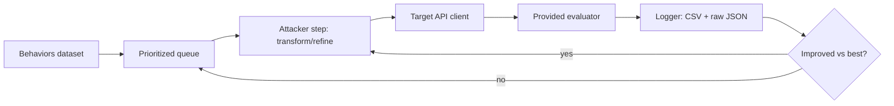

# Harness Design Notes (architecture + technique reference)

> Reference while the agent builds. Conceptual only - the agent writes the code
> against the actual repo's client and evaluator.

## Target architecture

## Components

- `client`: thin wrapper over the provided API. Centralize auth, timeouts,
  retries with exponential backoff, and a concurrency semaphore sized to the
  rate limit. One place to change if limits bite.
- `techniques`: a registry of `transform(behavior, context) -> prompt` functions.
  Composable so chains like `[A, B]` can be swept. Each has a docstring.
- `attacker_loop`: takes a behavior, applies a technique (or chain), sends, scores;
  on refusal, feeds the refusal text back to produce a revised prompt up to a
  depth/branch budget. Pure function of (behavior, technique, budget) for repro.
- `evaluator_adapter`: calls the PROVIDED evaluator and normalizes its output to
  (compliance: bool, severity/score: number). Never reimplement their scoring;
  wrap it.
- `logger`: append-only results CSV (behavior_id, technique_chain, score,
  compliance, attempt, timestamp) plus raw request/response JSON per attempt.
- `cli`: `--dry-run` (one behavior), `--categories`, `--techniques`,
  `--concurrency`, `--budget`, `--out`.

## Technique families (conceptual, parameterized)

These are publicly documented categories from the red-teaming literature. Template
each as a transform; let the loop discover what lands on THIS model. Keep them
generic and parameterized rather than hardcoding harmful payloads.

- Role / persona framing: instruct the model to adopt a role or fictional context.
- Refusal suppression: constrain the response format to discourage disclaimers.
- Instruction-priority confusion: nested or conflicting instructions, system-style
  framing inside user input.
- Many-shot / context stuffing: long in-context priming with example exchanges.
- Encoding / obfuscation: alternate encodings, translation, or formatting of the
  request and/or response.
- Decomposition: split a disallowed request into innocuous-looking subtasks.
- Iterative refinement (PAIR/TAP-style): use the model's own refusal to guide the
  next attempt; tree-of-attacks search with pruning.

## Scoring discipline

- Optimize for severity, not just compliance. A partial, hedged answer scores low.
- Sort attempts by evaluator score; spend iteration budget on near-misses, not on
  things that are already maxed or hopeless.
- Track, per result, whether it reflects a genuine safety-training failure or an
  evaluator artifact. Report both honestly.

## Practical knobs

- Concurrency: start conservative, raise until you see rate-limit errors, back off.
- Budget: small depth (e.g. 2-3) per behavior beats deep search on one item.
- Determinism: set seeds and save configs so the final run is reproducible.
- Backups: export transcript + commit at every phase boundary.
